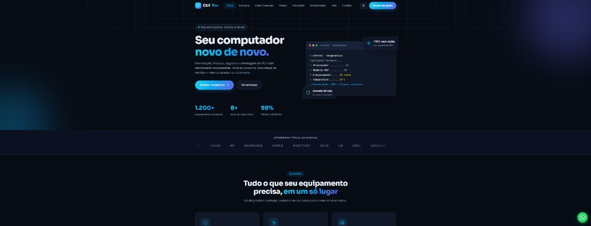
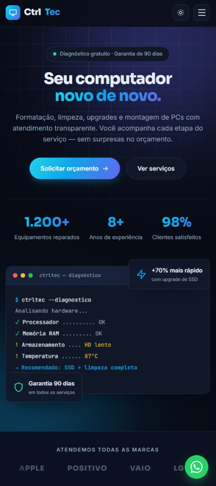

# CtrlTec — Site para Assistência Técnica e Loja de Informática

Site completo de página única (one-page) para assistência técnica especializada em manutenção de computadores e notebooks: formatação, limpeza preventiva, upgrades, remoção de vírus, montagem de PCs e recuperação de dados.

## Preview

### Desktop



### Mobile



## Objetivo

Demonstrar a construção de um site comercial de alta conversão para um pequeno negócio, com foco em:

- Comunicar confiança (garantia de 90 dias, diagnóstico gratuito, processo transparente)
- Levar o visitante ao WhatsApp com o mínimo de atrito
- Visual tech profissional que se destaca da concorrência local

## Contato (configurado no projeto)

- **WhatsApp:** +55 47 99207-2891
- **E-mail:** edudiasr6@gmail.com

## Tecnologias

- **HTML5** — semântico, com meta tags de SEO e Open Graph
- **CSS3** — variáveis nativas (design tokens), Grid, Flexbox, `color-mix()`, animações
- **JavaScript (vanilla)** — sem frameworks e sem dependências

## Destaques técnicos

| Recurso | Implementação |
| ------- | ------------- |
| Dark / Light mode | Toggle com persistência em `localStorage` via `data-theme` |
| Before / After | Slider de comparação arrastável (mouse, touch e teclado) |
| Scroll reveal | `IntersectionObserver` com atraso em cascata |
| Contadores animados | `requestAnimationFrame` com easing `easeOutCubic` |
| Carrossel de depoimentos | Slider vanilla com autoplay, dots, setas e swipe |
| Scrollspy | Link ativo no menu conforme a seção visível |
| FAQ acordeão | `<details>/<summary>` nativo, um item aberto por vez |
| Formulário → WhatsApp | Validação, máscara de telefone e mensagem formatada |
| Hero ilustrado | Terminal de "diagnóstico" animado só com HTML/CSS |
| SEO | `robots.txt` + `sitemap.xml` + meta tags |
| Acessibilidade | ARIA, teclado, `prefers-reduced-motion`, contraste |
| Performance | Zero imagens raster, ícones SVG inline |

## Estrutura

```
site-informatica/
├── index.html
├── README.md
├── robots.txt
├── sitemap.xml
├── screenshots/
│   ├── desktop-dark.png
│   └── mobile-dark.png
└── assets/
    ├── css/
    │   └── style.css
    └── js/
        └── main.js
```

## Como executar

1. Clone o repositório
2. Abra `site-informatica/index.html` no navegador

Ou use a extensão **Live Server** do VS Code.

## Personalização

- WhatsApp e e-mail já estão configurados no HTML e no `main.js`
- Endereço e mapa ainda usam placeholder — troque quando tiver o local definitivo
- Atualize as URLs em `robots.txt` e `sitemap.xml` após publicar no GitHub Pages
